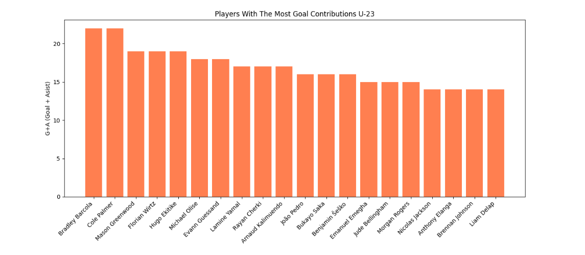
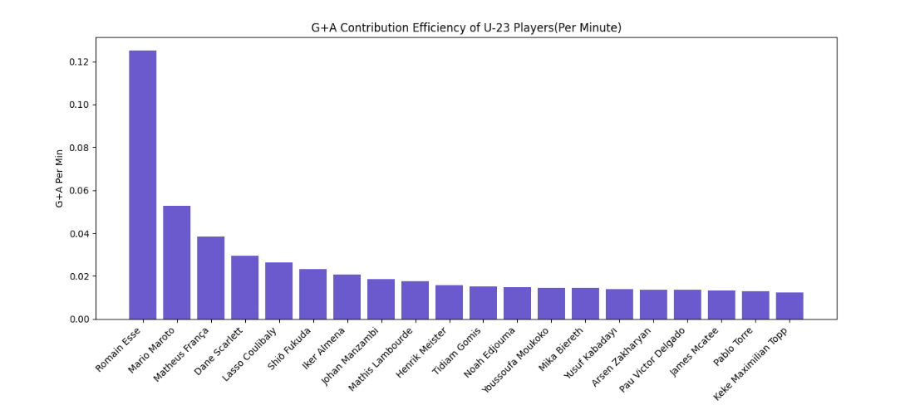
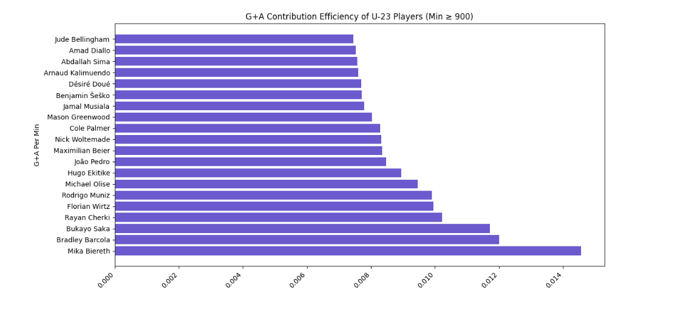
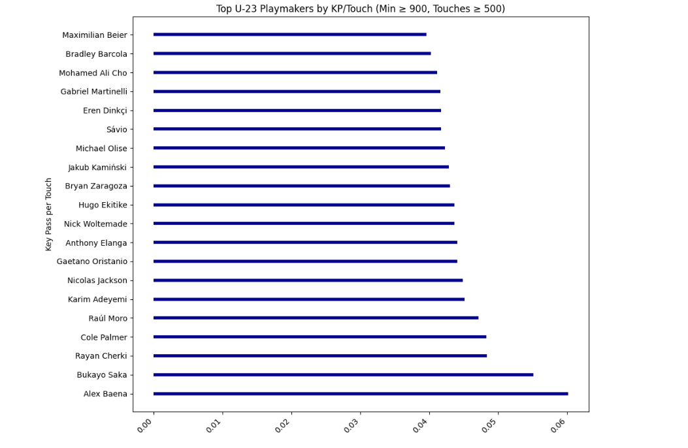
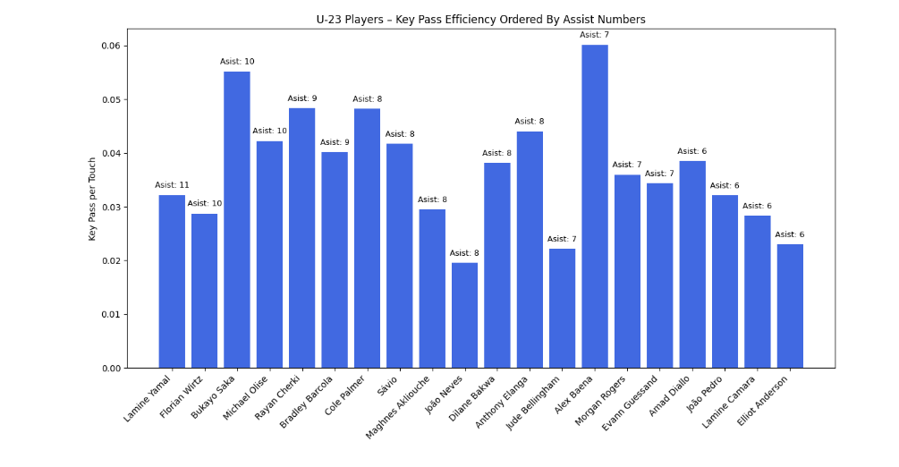
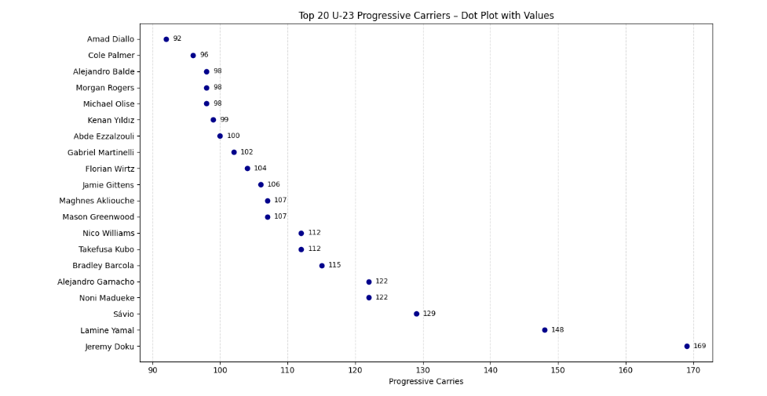
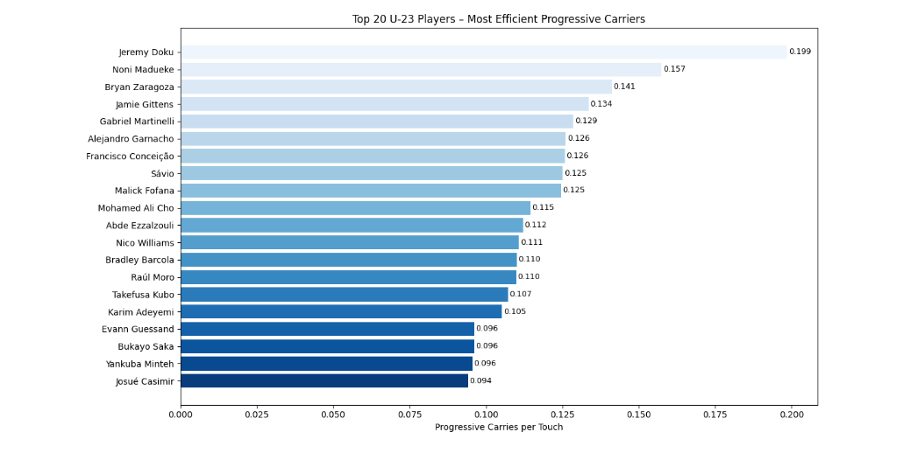

# 📊 Scouting Project - Results Overview

Bu klasör, Avrupa'nın beş büyük liginde forma giyen U-23 futbolcuları analiz ettiğim scouting projemin görselleştirme sonuçlarını içeriyor. Her grafik, oyuncuların hücum performanslarını farklı açılardan değerlendiren özel metrikler üzerinden oluşturulmuştur.

---

## ⚽ Most Goal Contributions

En yüksek gol katkısı yapan oyuncuların, 90 dakika başına toplam gol ve asist üretimleri analiz edilmiştir. Bu grafik, en üretken genç oyuncuları öne çıkarmayı amaçlar.

---

## 🧠 G+A Efficiency

90 dakika başına gol ve asist katkısı sağlayan oyuncuların, toplam 90 dakika sayısına göre konumlandığı bu grafik, katkının ne kadar sürdürülebilir olduğunu sorgular. Sadece yüksek katkı değil, bunu düzenli sağlayabilmek de önemlidir.

---

## 🔍 Filtered G+A Efficiency

Minimum 900 dakika süre almış oyuncularla oluşturulan bu versiyon, örneklem büyüklüğünün yeterli olduğu isimleri öne çıkarmayı hedefler. Bu sayede kısa süreli parlamalar yerine istikrarlı katkılar analiz edilir.

---

## 🎯 Key Pass Efficiency

Oyuncuların 90 dakika başına ürettikleri anahtar pasların, topla buluşma sayısına oranı hesaplanmıştır. Bu metrik, her topla temasın ne kadar değerli ve yaratıcı bir aksiyona dönüştüğünü anlamamızı sağlar.

---

## 📬 Key Pass to Assists List

Bu grafik, asist sayısı yüksek olan oyuncuların 90 dakika başına attıkları anahtar pas sayısının, toplam topla buluşma sayısına oranını gösterir. Yani, oyuncuların topla her buluşmasında ne kadar yaratıcı aksiyon üretebildiği analiz edilmiştir. Bu metrik, asist katkısının rastlantı değil, bilinçli ve sürekli bir yaratıcılıkla geldiğini anlamak için kullanılır.

---

## 🧩 Dribbling Numbers

Oyuncuların 90 dakika başına denediği dripling sayısı ile bu driplinglerin başarı oranı karşılaştırılmıştır. Hem yüksek hacimde dripling yapan hem de bunlarda başarılı olan oyuncular öne çıkar.

---

## 🧠 Dribbling Efficiency

Başarılı dripling oranı ile topla buluşma sayısı oranlanarak, topa her sahip olunduğunda ne kadar etkili bir dripling tehdidi oluşturulduğu analiz edilmiştir. Bu grafik, oyuncuların ne kadar verimli bir şekilde adam eksilttiğini gösterir.

---

## ✅ Final Transfer List

Tüm metrikler ve analizlerin ardından oluşturulan bu nihai liste, belirlenen kriterlere göre scout edilmesi gereken oyuncuları öne çıkarır. Liste, çok yönlü katkı sağlayan ve sürdürülebilir veriler üreten oyuncuları içerir.

---

📁 Bu grafikler, `results/` klasöründe yer almaktadır ve görsel analizlerin her biri projenin scouting karar destek mekanizmasına katkı sağlamaktadır.
